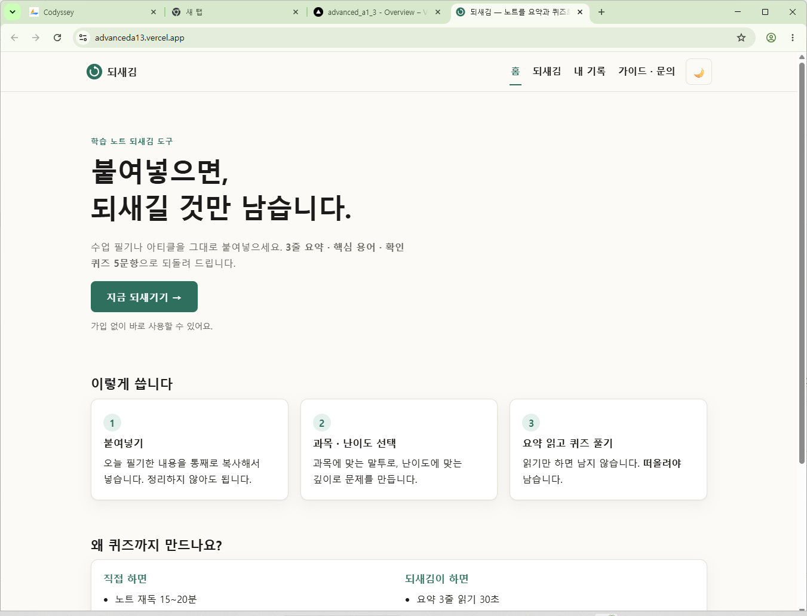
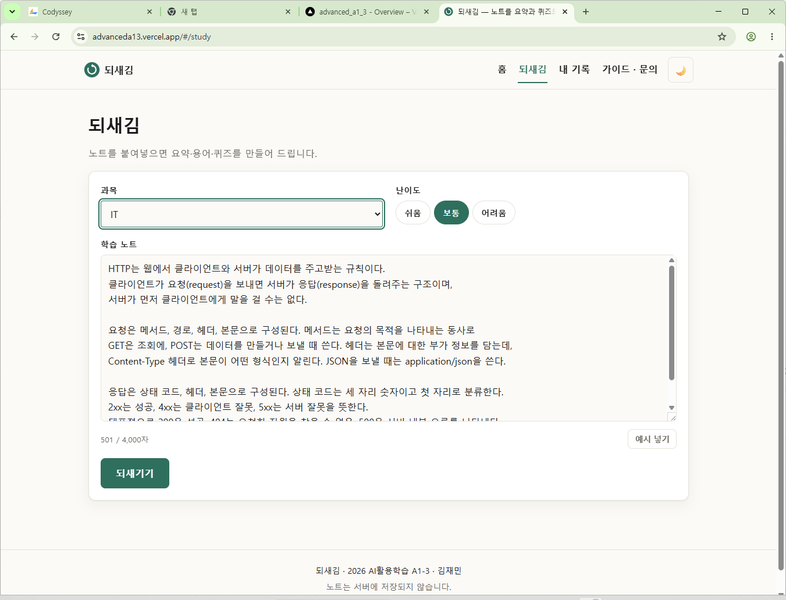
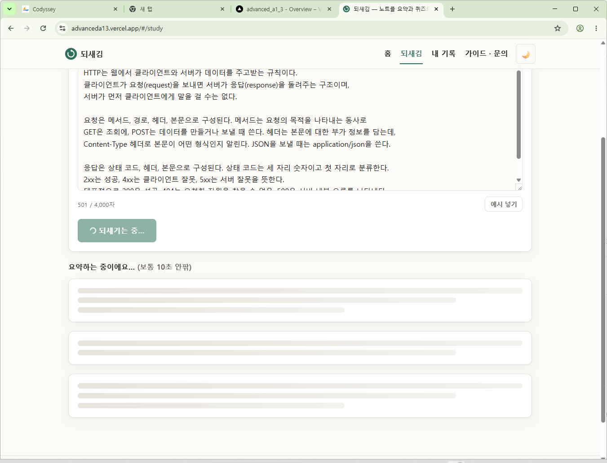
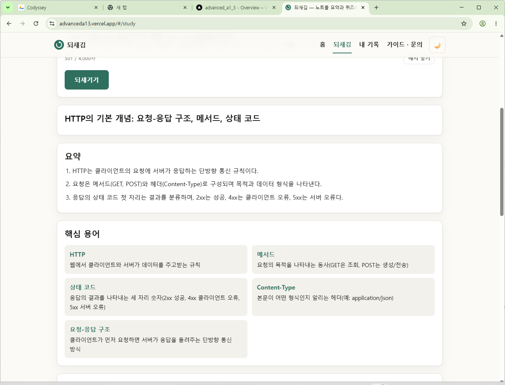
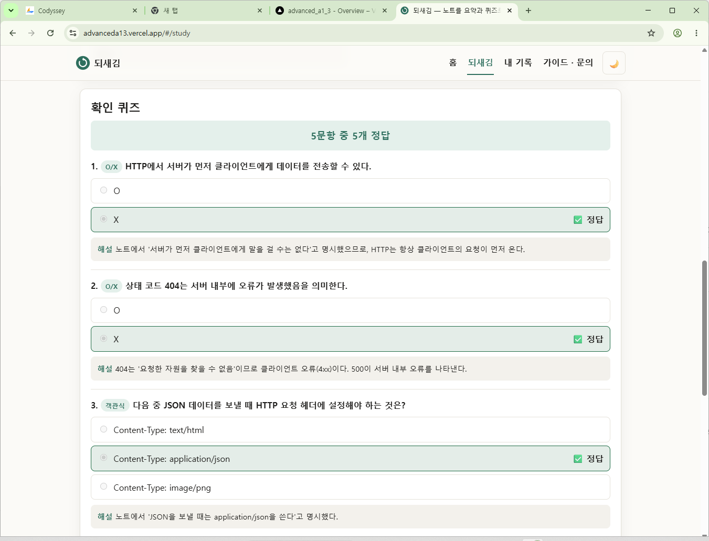
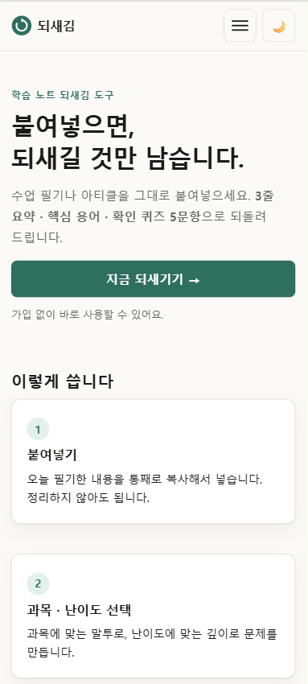
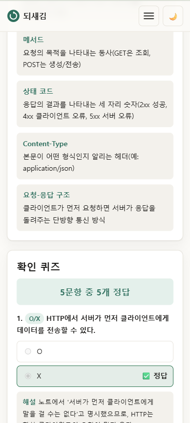
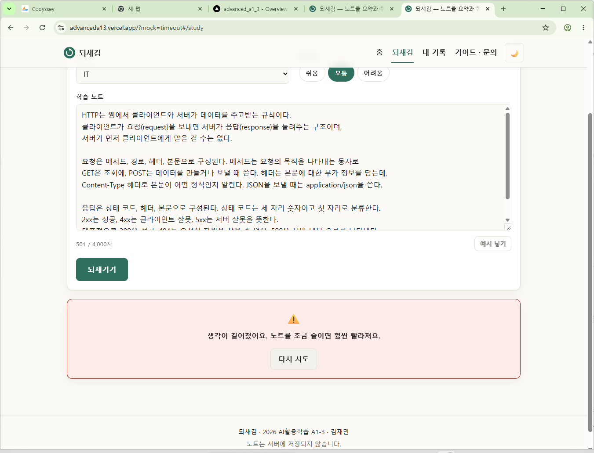
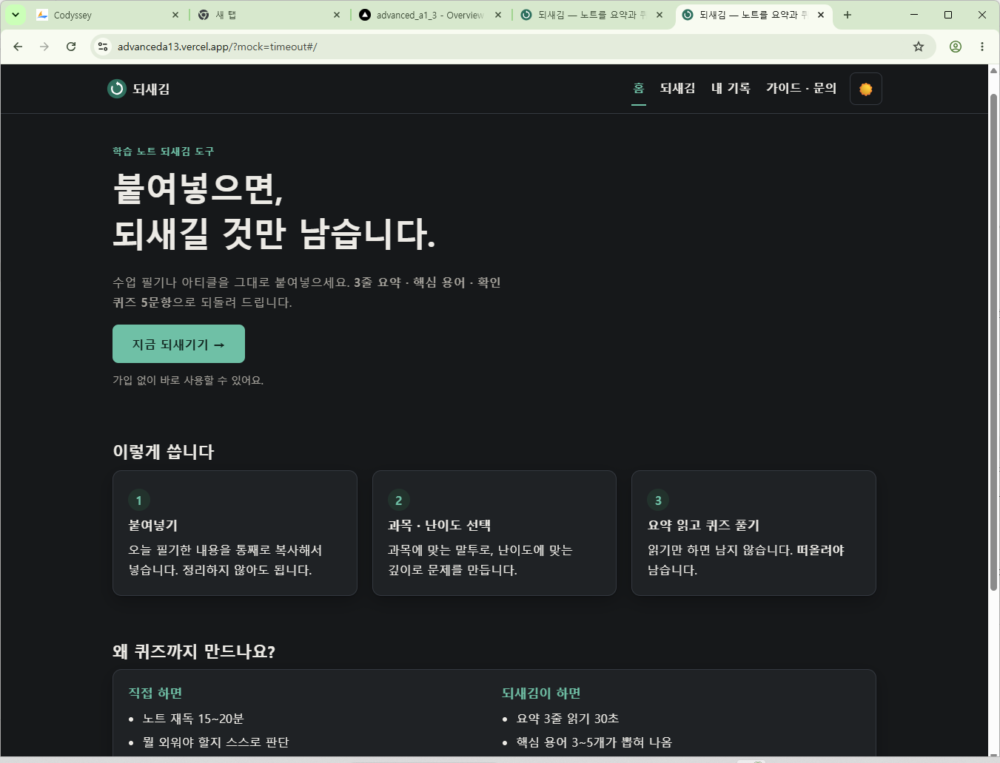
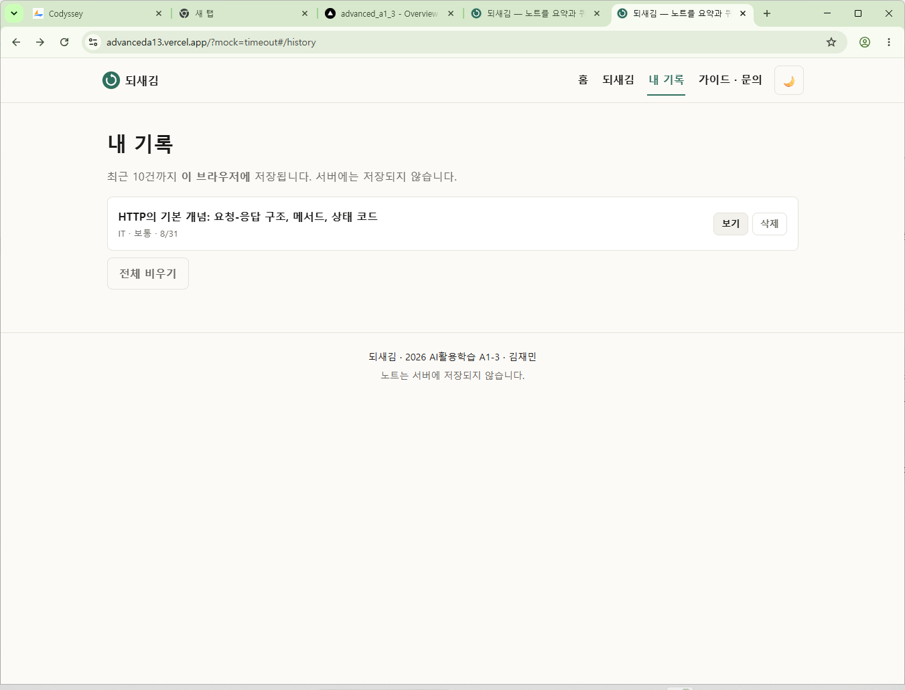

# 🌀 되새김 (Doesaegim)

> 붙여넣으면, 되새길 것만 남습니다.
> 학습 노트를 **3줄 요약 · 핵심 용어 · 확인 퀴즈 5문항**으로 되돌려주는 웹 서비스.

2026년 AI활용학습 **A1-3** 과제 · 김재민

**배포 URL** — <https://advanceda13.vercel.app>

---

## 1. 서비스 소개

노트 필기는 **쓰는 순간이 아니라 다시 볼 때** 효과가 납니다. 그런데 실제로는

- 필기해 놓고 다시 안 본다 — 분량이 많아 어디부터 볼지 모른다
- 다시 읽어도 "읽었다"는 느낌만 남고 기억에 남지 않는다 — 인출 연습 없이 재독만 한다

되새김은 이 두 문제를 **하나의 입력**으로 해결합니다. 노트를 붙여넣으면
어디부터 볼지 알려주는 **요약**, 뭘 외워야 하는지 알려주는 **핵심 용어**,
읽기가 아니라 떠올리기를 시키는 **퀴즈**를 한 번에 만들어 줍니다.

> 이름은 되새김질(반추)에서 왔습니다. 한 번 삼킨 내용을 다시 꺼내 씹어야 소화된다는
> 학습법(인출 연습, retrieval practice)을 그대로 이름으로 썼습니다.

**타겟 사용자** — 시험·자격증을 준비하는 학생, 부트캠프 수강생.
수업 직후 필기는 있는데 복습할 시간이 30분뿐인 상황.

### 기능

| 섹션 | 기능 | AI |
|------|------|:--:|
| 홈 `#/` | 서비스 소개, 3단계 사용법, 샘플 결과 | — |
| **되새김** `#/study` | 노트 입력 → 요약 3줄 · 용어 3~5개 · 퀴즈 5문항, **즉시 채점 + 해설** | ✅ |
| 내 기록 `#/history` | 최근 10건을 브라우저에 저장, 다시 보기 · 삭제 | — |
| 가이드 · 문의 `#/guide` | 학습법 가이드, FAQ, 문의 안내(GitHub 이슈) | — |

부가 기능 — 다크 모드(시스템 설정 자동 감지 + 수동 토글 기억), Markdown 복사,
스켈레톤 로딩 · 토스트 등 마이크로 인터랙션.

---

## 2. 기술 스택

| 구분 | 사용 기술 | 비고 |
|------|-----------|------|
| 프론트엔드 | **순수 HTML / CSS / JavaScript** | 프레임워크·빌드 도구 없음 (과제 제약) |
| 라우팅 | 해시 라우팅 (`#/study`) | 단일 `index.html` + 4개 `<section>` |
| 백엔드 | **Vercel Serverless Functions (Python 3.12)** | `api/*.py`, `BaseHTTPRequestHandler` |
| HTTP 클라이언트 | `requests` | 교육용 게이트웨이 규격에 맞춘 직접 호출 |
| AI | **Claude** (`claude-haiku-4`) | 교육용 게이트웨이 `copa.codyssey.kr` |
| 저장소 | `localStorage` | 로그인이 없으므로 서버에 저장하지 않음 |
| 배포 | GitHub → Vercel 자동 배포 | |

### 폴더 구조

```
├─ index.html          프론트 — 4개 섹션이 모두 들어 있다
├─ css/                base(변수·타이포) / layout(반응형) / components
├─ js/                 router · theme · api · study · history · mock
├─ api/                백엔드 — 각 .py 파일이 하나의 서버리스 함수
│  ├─ summarize.py       POST /api/summarize   ★ AI 기능
│  ├─ health.py          GET  /api/health      배포 진단용
│  └─ _shared.py         공용 헬퍼 (밑줄로 시작 → 라우트가 되지 않음)
├─ images/             로고 · OG 이미지
├─ docs/               기획서 · 스크린샷 · AI 도구 사용 로그
├─ dev_server.py       로컬 전용. Vercel이 해 주는 일을 흉내 낸다
├─ requirements.txt    requests 만
└─ vercel.json         함수 maxDuration 100초
```

---

## 3. 실행 방법

### 3-1. 필요한 것

- Python 3.12 이상
- 교육용 API 키(virtual key)

### 3-2. 환경 변수 설정

```bash
cp .env.example .env.local
```

`.env.local`을 열어 값을 채웁니다.

| 이름 | 필수 | 기본값 | 설명 |
|------|:----:|--------|------|
| `ANTHROPIC_API_KEY` | ✅ | — | 교육용 virtual key. `x-api-key` 헤더로 전송 |
| `CLAUDE_MODEL` | — | `claude-haiku-4` | 실측 10.5초. 품질을 올리려면 `claude-sonnet-4` (19~24초) |
| `COPA_API_URL` | — | `https://copa.codyssey.kr/v1/messages` | 엔드포인트가 바뀔 때만 |
| `RATE_LIMIT_PER_MIN` | — | `5` | IP별 분당 허용 호출 수 |

> ⚠️ **`.env.local`은 절대 커밋하지 마십시오.** `.gitignore`에 `.env*`로 등록돼 있습니다.
> `.env`만 적으면 `.env.local`이 걸러지지 않으니 규칙을 바꾸지 마세요.
> 실수로 커밋되면 파일을 고쳐도 소용없습니다 — 이력에 남으므로 **키 재발급이 유일한 조치**입니다.

### 3-3. 로컬 실행

| 방법 | 명령 | AI 기능 | 용도 |
|------|------|:------:|------|
| ① 전체 | `python dev_server.py` | ✅ | 정식 확인. `http://localhost:8000` |
| ② Vercel CLI | `vercel dev` | ✅ | 배포 환경에 가장 가까움 (Node 필요) |
| ③ 화면만 | `python -m http.server 8000` | ❌ | CSS 작업용 (`/api`는 404) |

```bash
pip install -r requirements.txt
python dev_server.py
```

**목업 모드** — 키도 네트워크도 없이 결과·실패 화면을 확인할 수 있습니다.

| URL | 결과 |
|-----|------|
| `?mock=1` | 정상 결과 (1.2초 지연 후) |
| `?mock=timeout` | 타임아웃 안내 화면 |
| `?mock=error` | API 오류 안내 화면 |
| `?mock=limit` | 호출 제한 안내 화면 |

---

## 4. 배포 방법 (Vercel)

1. GitHub에 저장소를 만들고 push 합니다.
2. Vercel → **Add New → Project → Import Git Repository**
3. **Framework Preset을 `Other`로 확인** — 자동 감지에 맡기지 마세요.
   Build Command·Output Directory는 비웁니다.
4. **Settings → Environment Variables**에 `ANTHROPIC_API_KEY`를 등록합니다.
   Production · Preview · Development를 **모두 체크**합니다.
5. Deploy. 이후 `git push` 할 때마다 자동 재배포됩니다.

> **환경 변수를 저장한 뒤에는 반드시 재배포해야 반영됩니다.**
> Deployments → 최신 배포 → ⋯ → **Redeploy**

### 배포 후 문제 진단

```
/api/... 가 404  →  ① 파일명·경로 (api/summarize.py → /api/summarize)
                    ② requirements.txt 에 fastapi/flask 가 들어갔는가
                    ③ 클래스 이름이 소문자 handler 인가
/api/... 가 500  →  /api/health 를 브라우저에서 열어본다
                    has_api_key: false  → 환경 변수 미설정 또는 재배포 누락
                    model: ""           → CLAUDE_MODEL 이 "빈 값"으로 등록돼 있다
                    custom_api_url:true → COPA_API_URL 이 비어 있거나 잘못됐다
                    true 인데 500       → Vercel Runtime Logs 확인
로컬은 되는데 배포만 →  환경 변수 / 패키지 / 파일명 대소문자
                    (Vercel은 Linux — Windows와 달리 대소문자를 구분한다)
CSS·JS가 옛날 것  →  강력 새로고침 (Ctrl+Shift+R)
```

---

## 5. 설계 결정 (왜 이렇게 만들었는가)

### 5-1. 왜 브라우저에서 AI를 직접 부르지 않는가

| 방법 | 문제 |
|------|------|
| `js/`에서 게이트웨이 직접 호출 | ❌ **개발자 도구 네트워크 탭에 키가 그대로 보인다.** 난독화해도 최종 파일에 문자열로 들어가면 끝 |
| 키를 빌드 때 주입 | ❌ 결과는 같다. 브라우저로 내려간 것은 전부 볼 수 있다 |
| **`api/`에 서버리스 함수를 두고 프론트는 `/api/summarize`만 호출** | ✅ **채택.** 키를 아는 것은 서버뿐 |

> 과정 자료의 JavaScript `fetch` 예시는 **API의 모양을 설명하기 위한 것**입니다.
> 그대로 `js/`에 옮기면 키가 공개됩니다. `api/` 폴더는 **키를 숨길 수 있는 유일한 장소**이고,
> 이것이 이 과제에서 서버리스 함수를 쓰는 진짜 이유입니다.

### 5-2. 페이지를 나눌 것인가, 섹션으로 둘 것인가

| 방법 | 문제 |
|------|------|
| `study.html`·`history.html` 등 파일 분리 | 헤더·네비·테마 스크립트를 4개 파일에 복제해야 한다. 메뉴 하나 고치려면 4곳을 고친다 |
| **단일 `index.html` + 해시 라우팅** | ✅ **채택.** 네비 활성화 처리가 JS의 역할을 보여주는 실습이 된다 |

뒤로 가기·북마크는 `hashchange` 이벤트로 처리하고, 알 수 없는 해시는 홈으로 폴백합니다.

### 5-3. JSON 출력을 어떻게 강제할 것인가

교육용 게이트웨이 규격에는 구조화 출력(`output_config`)이 없어서 **프롬프트로 지시**합니다.
대신 응답 처리를 4단계로 나눴습니다.

1. `stop_reason`을 `content`보다 **먼저** 확인 — `max_tokens`면 JSON이 잘려 있다
2. ` ```json ` 코드블록 껍데기 벗기기 — *지시는 요청이지 보장이 아니다*
3. `json.loads` — 실패하면 **정확히 1회만** 재시도
4. **의미 검증** — `answer`가 `options` 안에 있는지 등

> **파싱 성공 ≠ 검증 성공.** 3단계를 통과해도 정답이 보기 밖에 있으면 화면이 깨집니다.
> 그리고 **4단계 실패는 재시도하지 않습니다** — 응답 시간과 쿼터 소모가 2배가 되므로,
> "다시 시도" 버튼을 사용자에게 맡깁니다.

### 5-4. O/X 문항도 `options`를 갖는 이유

`ox`와 `choice`를 다른 모양으로 두면 스키마에 분기가 생기고 프론트에도 분기가 늘어납니다.
**O/X를 `options: ["O","X"]`인 객관식으로 통일**하면 렌더링·채점 코드가 하나로 끝납니다.
일부러 정규화하지 않은 설계 결정입니다.

### 5-5. 실패해도 화면이 멈추지 않게

**원칙: 화면이 아무 말 없이 멈추는 경우는 0이어야 한다.**
로딩이 끝났는데 결과도 오류도 없는 상태가 가장 나쁜 실패입니다.

| 실패 | 사용자에게 보이는 것 |
|------|---------------------|
| 빈 입력 · 100자 미만 · 4,000자 초과 | 입력란 아래 안내. **네트워크 요청을 보내지 않는다** |
| API 오류 (4xx/5xx) | "지금은 되새김이 잠시 쉬고 있어요" + [다시 시도] |
| 타임아웃 | "생각이 길어졌어요. **노트를 조금 줄이면** 훨씬 빨라져요" + [다시 시도] |

오류 메시지는 **사용자가 할 수 있는 행동**을 줍니다. "타임아웃이 발생했습니다"는 할 게 없습니다.
서버는 오류 **코드**만 내려보내고, 화면 문구는 `js/api.js`의 `MESSAGES` 한 군데에서 고릅니다 —
서버 문구가 그대로 나가면 영어·내부 용어가 새어 나오기 때문입니다.

### 5-6. 타임아웃 사다리 — 바깥쪽이 항상 더 길다

```
requests.post(timeout=40) × (파싱 실패 재호출 1회)  ≈ 최악 80초
프론트 AbortController                                90초
Vercel maxDuration                                   100초
```

프론트가 먼저 끊으면 서버는 **아무도 안 받는 곳으로** 성공 응답을 보냅니다.
사용자는 실패로 보는데 쿼터는 소모됩니다. 그래서 순서를 바꾸면 안 됩니다.

**숫자는 실측에서 나왔습니다.** 3,950자 노트 기준 `claude-haiku-4` 10.5초,
`claude-sonnet-4` 19~24초(편차 큼). 처음 잡았던 25초로는 sonnet이 간헐적으로
타임아웃에 걸려서 40초로 올렸고, 바깥 두 층도 함께 밀었습니다.
기본 모델을 haiku로 둔 것도 같은 측정 결과입니다 — **2배 빠르고 검증도 통과**했습니다.

### 5-7. 응답 지연 — 무엇이 느린지 먼저 쟀다

AI 호출이 이 서비스에서 유일하게 느린 부분입니다. 옵션을 나열하기 전에 **측정**했습니다.

**같은 입력을 3회 반복** (`claude-haiku-4`, 노트 501자)

| 회차 | 입력 토큰 | 출력 토큰 | 응답 시간 | ms / 출력 토큰 |
|:---:|---------:|---------:|--------:|-------------:|
| 1 | 1,320 | 1,309 | 8.6초 | 6.58 |
| 2 | 1,320 | 1,356 | 9.1초 | 6.69 |
| 3 | 1,320 | 1,633 | 11.3초 | 6.93 |
| (입력 3.3배) | **4,301** | 1,669 | 10.5초 | **6.29** |

같은 입력인데 시간이 8.6~11.3초로 흔들리지만 **ms/출력토큰은 일정**하고,
입력을 **3.3배**로 늘려도 그 값이 그대로입니다.

> **응답 시간 ≈ 출력 토큰 × 약 6.7ms.**
> **입력(프롬프트)은 응답 시간에 거의 기여하지 않습니다.**

이 결론이 우선순위를 정했습니다.

| 전략 | 채택 | 근거 |
|------|:----:|------|
| **클라이언트 캐시** | ✅ | 적중 시 **10초 → 즉시, 쿼터 소비 0.** 호출을 없애는 유일한 방법 |
| **모델 경량화** | ✅ | `claude-haiku-4` 10.5초 vs `claude-sonnet-4` 19~24초 (§5-6) |
| **체감 지연 완화** | ✅ | 스켈레톤 + "보통 10초 안팎" 예상 시간 + 버튼 스피너 |
| 프롬프트 축약 | ❌ | **측정상 입력은 지연에 기여하지 않음.** 쿼터 절약이 목적이라면 별개 |
| 출력 축약 (퀴즈 5→3문항) | ❌ | 약 30% 빨라지지만 **퀴즈가 이 서비스의 핵심 가치** |
| 서버·외부 캐시 (Vercel KV) | ❌ | 서버리스 인스턴스는 콜드 스타트마다 초기화. 외부 저장소는 과제 범위 밖 |
| 게이트웨이 프롬프트 캐싱 | ❌ | `cache_control`이 **규격에 없음**. 있어도 지연이 아니라 비용에 효과 |

**캐시 구현** — 같은 노트 + 과목 + 난이도면 결과가 같아도 되므로,
입력 지문(fingerprint)을 기록과 함께 저장해 두고 **호출 전에** 확인합니다.

```js
if (!force) {
  const hit = findCached(note, category, level);
  if (hit) { renderResult(hit.data, { fromCache: true }); return; }  // 네트워크 0건
}
```

**캐시를 숨기지 않습니다.** 적중하면 `저장된 결과` 배지가 붙고,
[다시 만들기]가 **[새로 만들기]**로 바뀌어 캐시를 건너뛰고 재호출합니다 —
사용자가 "왜 즉시 나왔지?"라고 의심하지 않도록.

| 검증 | API 호출 |
|------|:-------:|
| 첫 요청 | 1 |
| **같은 입력 재요청** | **1 — 늘지 않음** |
| 난이도만 변경 | 2 (미스) |
| [새로 만들기] | 3 (강제 재호출) |

한 노트를 여러 번 열어보는 **복습 시나리오**에 정확히 맞습니다. 자세한 근거는 [PRD §12.5](doesaegim_PRD.md).

### 5-8. 과목·난이도는 라벨이 아니라 지시로 넘긴다

처음에는 프롬프트에 `과목: IT`처럼 **이름만** 넣었습니다. 그럴듯해 보였지만
**같은 노트로 과목만 바꿔 3번 호출해 보니 결과가 사실상 동일했습니다.**

| 과목 | 뽑힌 용어 (수정 전) |
|------|---------------------|
| 일반 | HTTP, 메서드, 헤더, 상태 코드, Content-Type |
| IT | HTTP, 메서드, 상태 코드, Content-Type, 요청-응답 |
| 어학 | 요청(request), 응답(response), 메서드, … |

문장 순서만 다를 뿐, `IT`로 두 번 돌려도 나오는 **생성 편차** 수준이었습니다.
**"무엇을 다르게 하라"는 지시가 없으면 모델은 라벨을 무시합니다.**

그래서 `CATEGORY_HINT`를 넣어 **지시**를 함께 보내도록 바꿨습니다.

```
과목: IT
  → 기술 용어는 원어를 함께 적는다(예: 메서드(method)).
     동작 순서와 원인·결과를 묻는 문항을 우선한다.
```

**수정 후 같은 측정** — 이번에는 확실히 갈립니다.

| 과목 | 실제로 달라진 것 |
|------|------------------|
| **IT** | 용어에 원어 병기 — `메서드(method)`, `상태 코드(status code)`, `요청-응답(request-response)` |
| **어학** | 질문이 **용법 중심** — "어느 헤더에 **어떤 값을** 써야 하나?" |
| **경영** | 문항에 **사례가 붙음** — "사용자가 **상품 목록 페이지**를 로드할 때 어떤 메서드를…" |

`LEVEL_HINT`도 `"용어 확인 위주"` 같은 **한 단어**에서 한 문장으로 늘렸습니다.
같은 이유로 너무 약했습니다.

> **배운 점** — 프롬프트에 값을 넣었다고 그 값이 쓰이는 게 아닙니다.
> **넣은 뒤 바꿔가며 재봐야** 실제로 동작하는지 알 수 있습니다.
> 화면에는 "과목에 맞게 만듭니다"라고 써 두고 코드는 그러지 않던 상태였습니다.

### 5-9. 기록을 서버에 저장하지 않는 이유

이 서비스에는 로그인이 없습니다. 로그인 없이 서버에 저장하면 **누구의 기록인지 구분할 수 없고**,
남의 노트를 볼 수 있는 구조가 됩니다. "저장은 하되 서버에 두지 않는다"가 정직한 선택입니다.

### 5-10. 문의는 폼 대신 GitHub 이슈로

처음에는 문의 폼 + 외부 웹훅(`POST /api/feedback`)으로 만들었습니다.
코드는 동작했지만 **보낼 곳(`WEBHOOK_URL`)을 연결하지 않아** 실제로 누르면
"문의 채널이 아직 연결되지 않았어요"가 떴습니다.

| 안 | 문제 |
|----|------|
| 웹훅 연결 (Apps Script 등) | 개인 계정에 묶인 URL을 운영해야 한다. 그 URL 자체가 비밀이라 과제 저장소와 함께 관리하기 부담 |
| 폼은 두고 안내만 | **화면에 있는 것이 동작하지 않는다.** 가장 나쁜 상태 |
| **폼을 없애고 GitHub 이슈로 안내** | ✅ **채택.** 학습용 프로젝트에 맞고, 코드가 공개돼 있어 이슈가 자연스러운 창구 |

> **화면에 보이는데 눌러도 안 되는 기능은 없느니만 못합니다.**
> 폼을 지우면서 `api/feedback.py`·`js/feedback.js`·`WEBHOOK_URL`도 함께 지웠습니다.
> **죽은 코드를 남겨두는 것보다 없는 편이 정직합니다.** (되살리려면 git 이력에 있습니다.)

### 5-11. 호출 제한의 한계를 숨기지 않는다

IP별 분당 제한은 **인스턴스 메모리 기반이라 완벽하지 않습니다.** 서버리스는 요청마다 다른
인스턴스가 뜰 수 있고 콜드 스타트 때 초기화됩니다. "실수로 연타하는 사용자"는 막지만
"작정한 사람"은 못 막습니다. 제대로 하려면 외부 저장소가 필요한데 과제 범위 밖이라
**의도적으로 넣지 않았습니다.** 대신 입력 4,000자 상한과 프론트 10초 쿨다운이 함께 막습니다.

---

## 6. 스크린샷

### 데스크톱

**홈** — 히어로 · 3단계 사용법



**입력** — 과목·난이도 선택, 실시간 글자 카운터(`501 / 4,000자`)



**로딩** — 스켈레톤 카드 + 예상 시간 안내. 버튼은 스피너와 함께 비활성화됩니다.



### ⭐ AI 기능 — 입력에서 결과까지

**결과** — 주제 · 요약 3줄 · 핵심 용어 5개



**채점** — 점수 + ✅/❌ + 해설. 해설은 **채점 전에는 화면에 없습니다.**



### 모바일 (375 × 812)

| 홈 | AI 결과 |
|---|---|
|  |  |

1열 레이아웃 · 햄버거 메뉴 · 가로 스크롤 0px.

### 실패 처리 · 부가 기능

**타임아웃 안내** — 사용자가 **할 수 있는 행동**을 알려주고 [다시 시도]를 제공합니다.



| 다크 모드 (보너스 A) | 내 기록 (보너스 B) |
|---|---|
|  |  |

---

## 7. 문서

- [서비스 기획서](docs/서비스기획서.md) — 목적 · 타겟 · 페이지 구성 · AI 입출력/실패 기준
- [PRD](doesaegim_PRD.md) — 전체 설계 명세와 7일 실행 계획
- [CLAUDE.md](CLAUDE.md) — AI 코딩 도구용 작업 규칙
